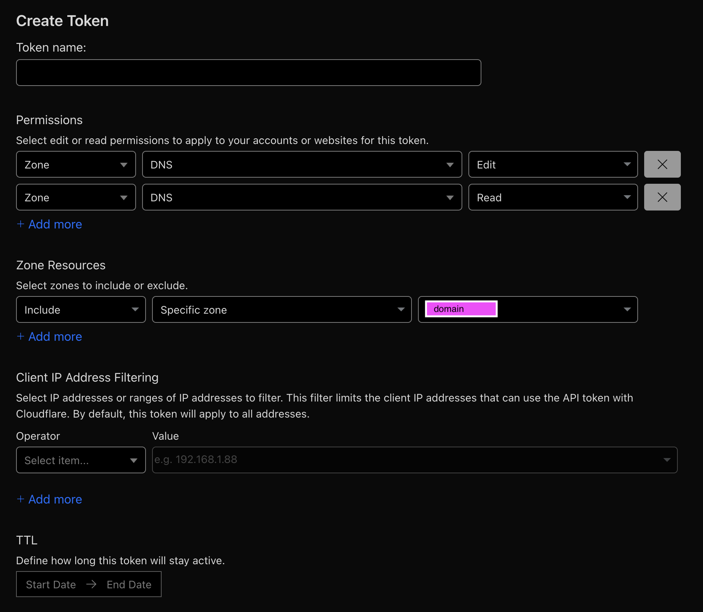

# Domain Configuration

### Caddy + Cloudflare (Token Generation)
1. Add your domain to Cloudflare
2. Assign preferred domain/subdomain 2 A records to the internal IPv4 IP (Direct and wildcard). Ensure Proxy is disabled (DNS only).

3. Create an API Key for Caddy to use - Navigate to the person at the top right corner > Profile > API Tokens > Create Token > Use the "Edit zone DNS" template. Setup IP filtering if you want. Ignore TTL.

4. Rename secrets.yaml.example to secrets.yaml and fill out your Cloudflare email and API token.