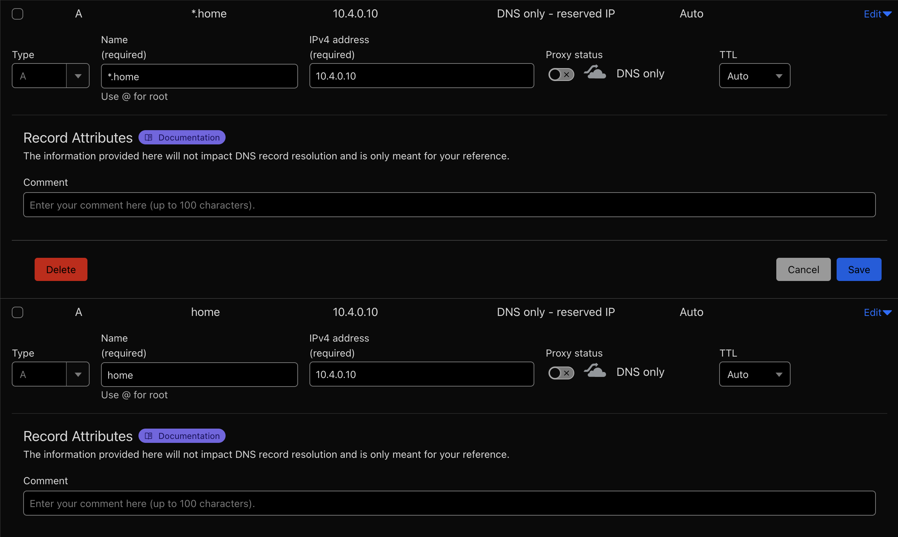

# Domain Configuration

### Set Domain
- In `/vars/default.yaml`, set `caddy_wildcard_domain` and `caddy_domain` to your domain, copying the example format.

### Caddy + Cloudflare API Key Generation
1. Add your domain to Cloudflare - Use the free tier.
2. Assign preferred domain/subdomain 2 A records to the internal IPv4 IP (Direct and wildcard). Ensure Proxy is disabled (DNS only).

3. Create an API Key for Caddy to use - Navigate to the person at the top right corner > Profile > API Tokens > Create Token > Use the "Edit zone DNS" template. Setup IP filtering if you want. Ignore TTL.

4. Fill out your Cloudflare email and API token in `/vars/secrets.yaml`.